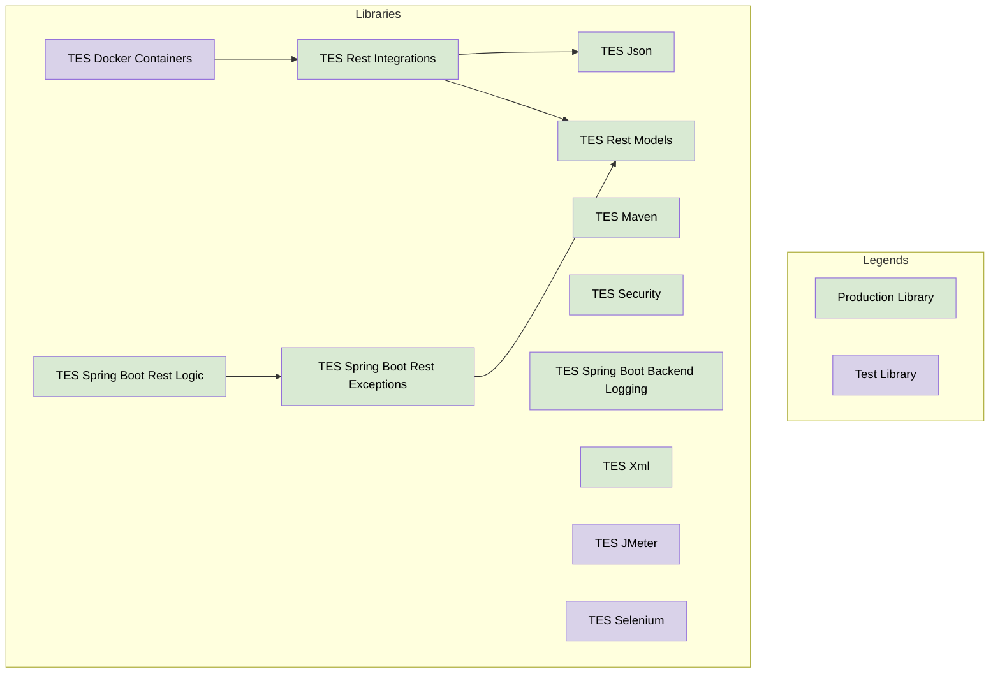

# TES Foundation

## Libraries

The foundation defines the following libraries that is designed to be used in production code:

- [TES JSON](../tes-json/README.md): Common way to work with JSON.
- [TES Maven](../tes-maven/README.md): Simple integration with a Maven repository.
- [TES XML](../tes-xml/README.md): Common way to work with XML.
- [TES Rest Integrations](../tes-rest-integrations/README.md): Capabilities to integrate TES backend 
  services with each order.
- [TES Rest Models](../tes-rest-models/README.md): Common definition of REST models and transformation of paginating 
  models.
- [TES Security](../tes-security/README.md): Security requirements when working with certificates.
- [TES Spring Boot Backend Logging](../tes-spring-boot-backend-logging/README.md): Common logging with Spring Boot
- [TES Spring Boot Rest Exceptions](../tes-spring-boot-rest-exceptions/README.md): Global exception handling for 
  TES backends with Spring Boot
- [TES Spring Boot Rest Logic](../tes-spring-boot-rest-logic/README.md): Library with logic exceptions and 
  utility classes for Spring Boot Rest applications

The foundation defines the following libraries that is designed to be used in testing code:

- [TES Docker Containers](../tes-docker-containers/README.md): Standardisation of working with Docker containers
  in component, stress and system tests.
- [TES JMeter](../tes-jmeter/README.md): Executing stress or performance tests with JMeter
- [TES Selenium](../tes-selenium/README.md): TES Selenium is created to make it easier to use Selenium 
  for testing web frontends.

### Dependencies

This diagram shows the dependencies between all the libraries in TES Foundation

