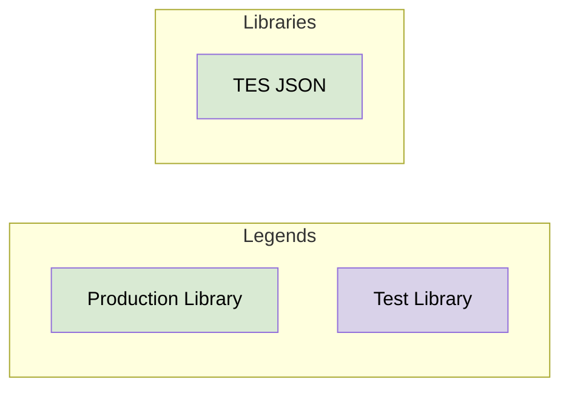

# TES Foundation

## Libraries

The foundation defines the following libraries that is designed to be used in production code:

- [TES JSON](tes-json/README.md): Common way to work with JSON.

### Dependencies

This diagram shows the dependencies between all the libraries in TES Foundation

