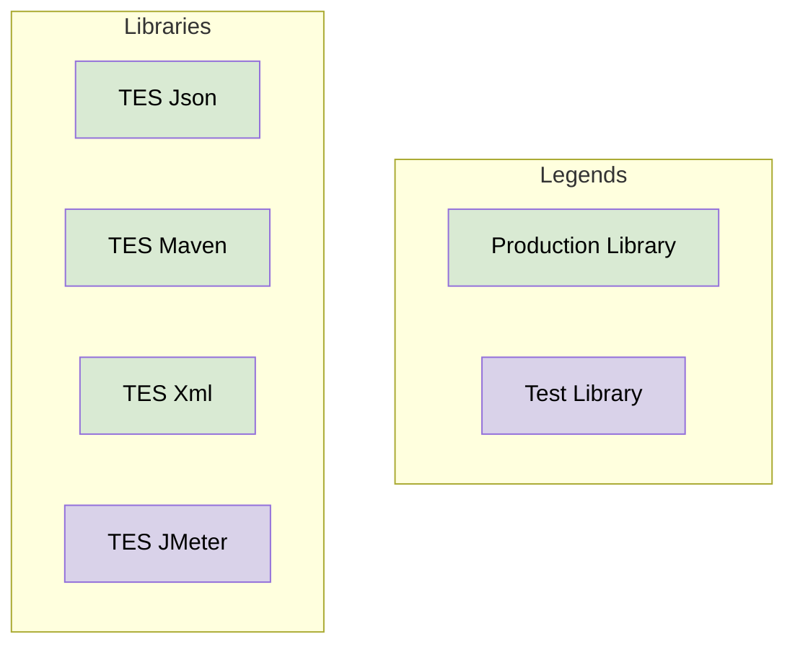

# TES Foundation

## Libraries

The foundation defines the following libraries that is designed to be used in production code:

- [TES JSON](../tes-json/README.md): Common way to work with JSON.
- [TES Maven](../tes-maven/README.md): Simple integration with a Maven repository.
- [TES XML](../tes-xml/README.md): Common way to work with XML.

The foundation defines the following libraries that is designed to be used in testing code:

- [TES JMeter](../tes-jmeter/README.md): Executing stress or performance tests with JMeter

### Dependencies

This diagram shows the dependencies between all the libraries in TES Foundation

