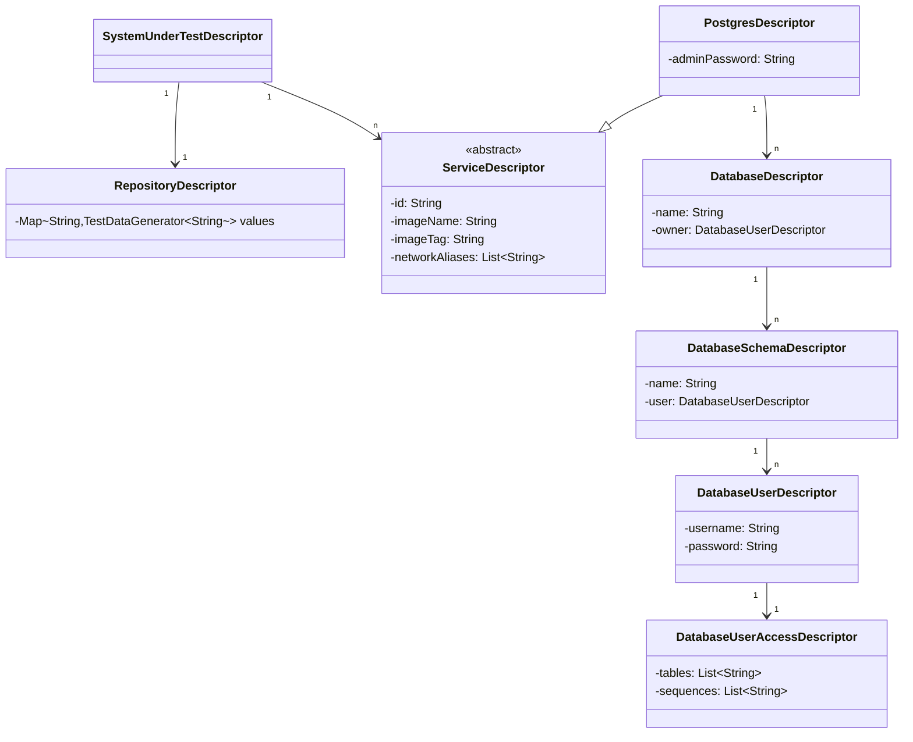
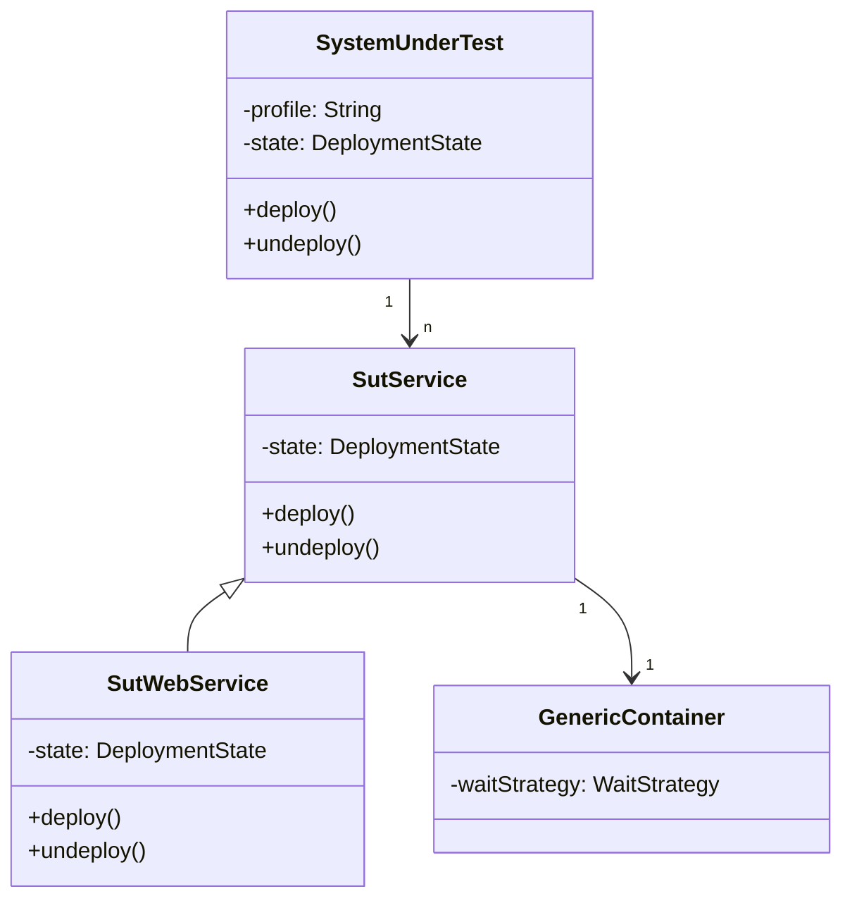

# Design of TES SUT Engine

## Diagrams

### System Under Test Descriptor 

### System Under Test

### System Under Test Engine

## Classes & Interfaces

### System description

- `SystemUnderTestDescriptor`: `SystemUnderTestDescriptor` is the main class to describe a system under tests.
- `RepositoryDescriptor`: Describes a set of values that can be accessed from `ServiceDescriptor`
